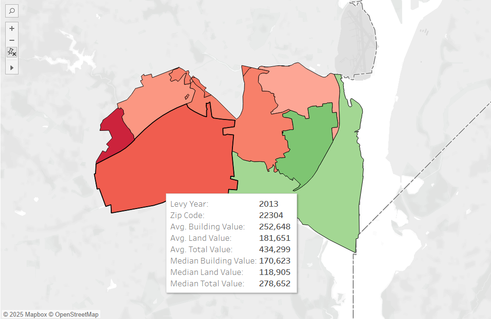

# Alexandria, VA Real Estate Analysis 🏡📊

## Overview

This personal project explores transitory annual property assessment data in Alexandria, Virginia from 2011 to 2023. The goal was to understand trends in property values and how different property characteristics influence assessment changes over time.

Using a combination of data scraping, cleaning, modeling, and visualization, I developed an interactive and informative dataset that allows users to explore patterns by zip code and property type. This project not only offers a comprehensive view of real estate shifts in Alexandria, but also applies statistical and machine learning techniques to predict future assessments.

---

## Key Features

- **Data Collection:** Scraped historical assessment data from the City of Alexandria’s official portal  
- **Data Wrangling:** Cleaned and merged raw datasets into structured formats  
- **Feature Engineering:** Extracted key property characteristics such as square footage, year built, number of bedrooms, etc.  
- **Modeling:** Built predictive models to estimate future taxable assessments  
- **Visualization:** Created interactive maps and dashboards to display changes in property values by zip code  

---

## Sample Visualization

---

## Technologies Used

- Python (Pandas, Scikit-learn, Matplotlib, Seaborn, Folium)
- Geopandas for spatial analysis
- Jupyter Notebooks
- Git for version control

---

## Insights

- Identified zip codes with the highest and lowest assessment growth
- Found strong correlations between square footage and annual increases
- Detected potential outliers and unusual reassessments across neighborhoods
- Enabled forecast modeling for future years to assist with valuation planning

---

## Future Work

- Expand to other cities in Northern Virginia
- Incorporate rental and sales data to correlate with assessments
- Deploy as a lightweight web app with user interaction

---

## Author

**Barrett Dalbec**  
